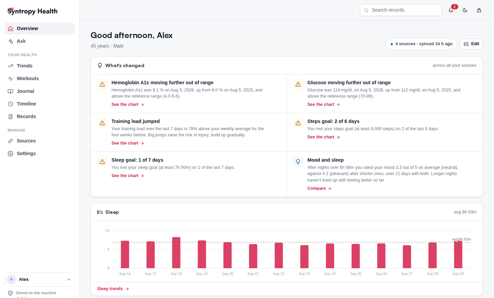
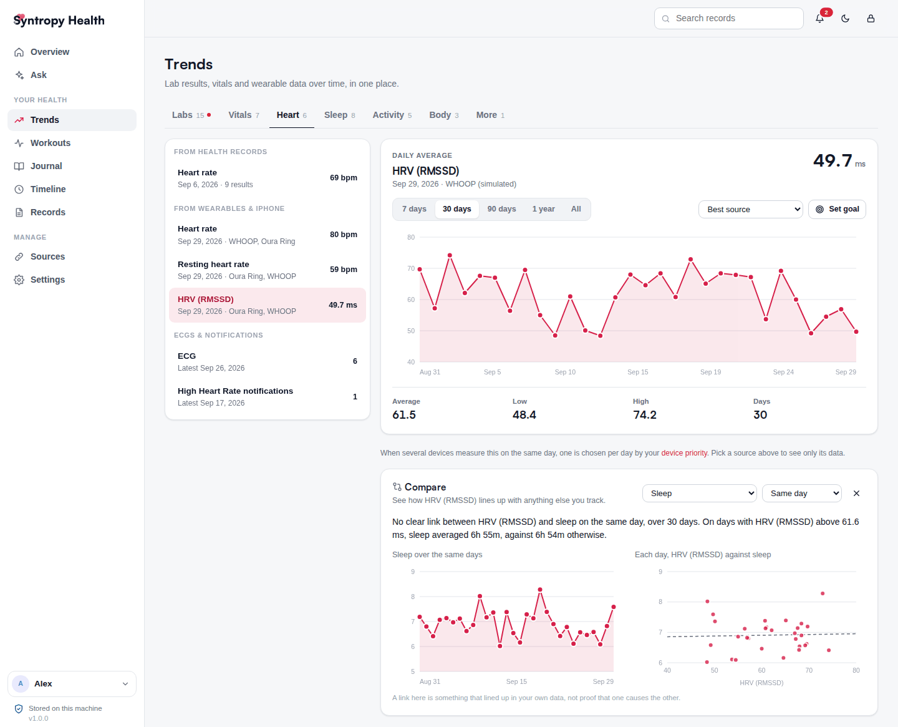

# Syntropy Health

**The open-source, self-hosted personal health record.**
Medical records from your patient portals, Apple Health and wearable data, and insights across all of it, on a computer you control.

[Website](https://health.syntropylabs.io) · [Get started](#get-started) · [Docs](#documentation) · [Changelog](CHANGELOG.md)

## Why Syntropy Health

Your health data is scattered: lab results and diagnoses in one patient portal per hospital, sleep and heart rate in a
ring or watch app, workouts somewhere else, how you actually felt nowhere at all. Syntropy Health brings it together in
one private record that runs on your own Mac, PC or home server, so you can see the whole picture, and what no single
app can show you: how your sleep lines up with how you feel, what changed after a medication started, a lab result
moving further out of range.

- **Your medical records, from every provider.** Connects to patient portals such as Epic MyChart and Oracle Health
  through the standard SMART on FHIR patient-access APIs, and merges labs, medications, conditions, visits and notes
  from every health system into one de-duplicated record.
- **Your wearables and Apple Health.** Apple Watch and iPhone data through the Syntropy Health iPhone app, plus Oura,
  WHOOP and Google Health (Fitbit, Pixel Watch), without double-counting devices.
- **Insights across sources.** Trends, sleep, training and a daily journal in one place, with patterns and changes
  from your own normal surfaced for you, always with the numbers behind them.
- **Ask with the AI you choose.** A local model (Ollama, LM Studio) so nothing leaves your network, your own API key,
  or the AI apps you already use through the built-in [Model Context Protocol](https://modelcontextprotocol.io) server.
  Access is read-only and every lookup is logged.
- **Private by design.** No Syntropy cloud: your data lives in one SQLite database on your own hardware, behind a
  password, with tokens and keys encrypted, and Syntropy Labs never receives it. Export to FHIR R4 or CSV any time.
- **For the people you care for.** Keep records for a partner, a child or a parent, and share access within your
  household.

## Get started

| Your computer | Install |
|---|---|
| **Mac** | `curl -fsSL https://health.syntropylabs.io/install.sh \| sh` |
| **Windows** | `irm https://health.syntropylabs.io/install.ps1 \| iex` (PowerShell) |
| **Linux home server** | `curl -fsSL https://health.syntropylabs.io/install.sh \| sudo sh` |
| **Docker / NAS** | `docker run -d --name syntropy-health --restart unless-stopped -p 8000:8000 -v syntropy-data:/data ghcr.io/enriqueneyra/syntropy-health` |
| **From source** | `git clone https://github.com/EnriqueNeyra/syntropy-health && cd syntropy-health && ./run.sh` |

Then open <http://localhost:8000> and follow the setup. No accounts handy? Connect to the built-in **EHR simulator**
and add simulated Oura or WHOOP data to explore everything with synthetic records.

> **Status:** Syntropy Health is in beta. Registration with EHR vendors is under way, so until it's complete,
> health-system connections run against the built-in simulator (or a vendor sandbox with your own client ID). Oura,
> WHOOP, Google Health, Apple Health exports and lab reports work with real data today, and the iPhone app is on its way
> to the App Store.

Syntropy Health tells you when a new version is out, and the Mac and Windows apps can install updates themselves.
Install options, configuration and remote access are in the step-by-step guides at
[health.syntropylabs.io/setup](https://health.syntropylabs.io/setup/).

## Documentation

- [Set up](https://health.syntropylabs.io/setup/): install on a Mac, Windows PC, Linux home server or Docker, and the iPhone app
- [How it works](https://health.syntropylabs.io/docs/): architecture, the data handled and the security model

## Contributing

Bug reports, ideas and pull requests are welcome. Read [CONTRIBUTING.md](.github/CONTRIBUTING.md) to get set up (the test suite
runs fully offline against the simulator), and please never include real health information in an issue. Security
problems go to [SECURITY.md](.github/SECURITY.md), not a public issue. Everyone taking part follows the
[code of conduct](.github/CODE_OF_CONDUCT.md).

## Disclaimer

Syntropy Health organizes information you're entitled to under the 21st Century Cures Act. It is not a medical device
and doesn't give medical advice: check anything important with your care team.

## License

Free and open source under the [GNU Affero General Public License v3.0 only](LICENSE). You can use, study, change and
share it; if you share a changed version, or run one that other people use over a network, offer them its source under
the same license. The Syntropy Health name, logo and icons aren't covered: see [NOTICE](NOTICE).
